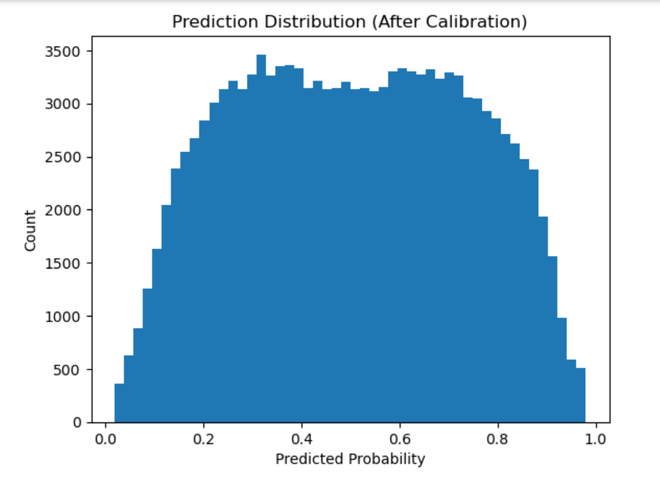

March Madness 2026 – Machine Learning Prediction Model

Overview

This project develops a data-driven machine learning pipeline to predict NCAA March Madness tournament outcomes for both men’s and women’s competitions.

The solution leverages historical game data, advanced team metrics, and ensemble modeling techniques to generate probabilistic predictions for over 132,000 matchups.


Key Highlights

1. End-to-end machine learning pipeline (data ingestion → feature engineering → modeling → prediction)
2. Season-based cross-validation for realistic evaluation
3. Ensemble modeling using:
    a. Logistic Regression
    b. Ridge Regression
    c. XGBoost
4. Optimization using Brier Score (probability calibration metric)
5. Balanced probability outputs to avoid overconfidence
6. Final predictions formatted for Kaggle submission

Dataset Summary

The model uses official NCAA datasets, including:

1. Regular season results (men and women)
2. Tournament results
3. Tournament seeds
4. Massey Ordinals (ranking systems)
5. Team conference data

Scale of data:

Over 5.8 million ranking records
40+ seasons for men’s data
29+ seasons for women’s data


Feature Engineering

A total of 24 engineered features were used, including:

1. Win rate difference
2. Point differential
3. Elo rating difference
4. Strength of schedule (SOS)
5. Seed difference
6. Offensive and defensive efficiency metrics
7. Massey consensus rankings
8. Conference strength indicators
9. Upset probability features

These features capture both team quality and matchup-level dynamics.

Model Training Strategy

Season-Based Cross-Validation

Instead of random train-test splits, the model follows a time-aware validation approach:

a. Train on past seasons
b. Validate on future seasons

This setup better reflects real-world tournament prediction scenarios.


Model Performance

Men’s Tournament

1. Mean Brier Score: 0.18672
2. Ensemble weights:

   a. Logistic Regression: 39.3%
   b. Ridge Regression: 41.5%
   c. XGBoost: 19.1%

Women’s Tournament

1. Mean Brier Score: 0.13388
2. Ensemble weights:

   a. Logistic Regression: 40%
   b. Ridge Regression: 60%
   c. XGBoost: 0%

Combined Performance

Final Brier Score: 0.16030

Prediction Characteristics

The model produces well-calibrated probability outputs:

Range: 0.02 to 0.98
Mean: 0.503
Standard deviation: 0.235
Less than 1% of predictions at extreme boundaries

This ensures stable and realistic predictions.

Visualization

The project includes matplotlib-based visualizations such as:

1. Prediction probability distributions
2. Model calibration curves
3. Feature importance analysis




Final Output

Total predictions: 132,133 matchups


Validation checks performed:

1. No missing values
2. No duplicate IDs
3. Predictions within valid probability range
4. Balanced distribution of outputs


Tech Stack

Python
Pandas, NumPy
Scikit-learn
XGBoost
Matplotlib


How to Run
Install dependencies:

```bash
pip install pandas numpy scikit-learn xgboost matplotlib
```

Run the notebook:

```bash
jupyter notebook Kaggle_March_Mania.ipynb
```

Project Objective

The goal of this project is to build a robust and generalizable machine learning system for predicting tournament outcomes using:

Historical performance trends
Team strength metrics
Advanced ranking systems

Key Learnings

1. Importance of time-aware validation in predictive modeling
2. Impact of feature engineering in sports analytics
3. Benefits of ensemble modeling for stability
4. Importance of probability calibration in prediction tasks

